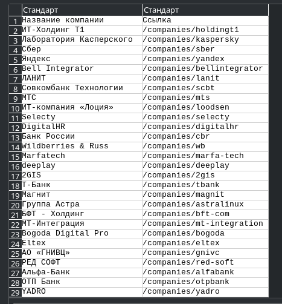

# instruments_marketings
Instruments marketings - это скрипты или инструменты, которые повышают работу маркетолога, делая её эффективнее.

## Презентация

Для сбора базы данных я разработал асинхронный парсер на Python, который за несколько секунд собрал более 100 целевых компаний с портала "Хабр Карьера" (в качестве примера).

Этот инструмент является не просто сборщиком контактов, а прототипом масштабируемой системы для лидогенерации. 

**Я вижу три ключевых направления для его развития:**

- *Обогащение данных:* Автоматический сбор технологического стека и описания компании для создания персонализированных предложений;
- *Поиск ЛПР:* Парсинг сайтов компаний и интеграция с внешними сервисами для нахождения email-адресов руководителей;
- *Скоринг лидов:* Внедрение системы оценки для приоритизации наиболее перспективных клиентов.

Такой подход позволяет перейти от ручного сбора контактов к автоматизированному "конвейеру лидов", что полностью соответствует современным практикам growth-маркетинга.

**Что я ещё могу предложить:**

- Доработать текущий парсер для удобного использования маркетологом;
- Написать сервис для автоматических рассылок, работающий с SMTP-сервере для электронных писем;
- Разработка других веб-приложений, скриптов, сервисов, которые вам были-бы нужны и полезны;
- Работа с реляционными базами данных через python;
- Создание docker контейнеров, deploy на vps (удалённый сервер).

**Кем я являюсь:**

- Программирую на Python;
- Писатель IT статей;
- Косвенно как и любой программист связан с маркетингом, но маркетологом не являюсь;
- Люблю изучать новое и брать любые задачи.